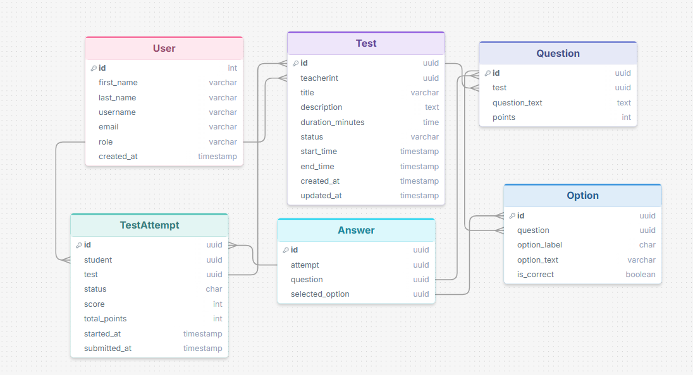

# ASSESSMENT Platform


## ER diagram



## Setup & Run

### Prerequisites

- Python 3.11+
- pip

---

### 1. Clone the Repository

```bash
git clone https://github.com/Shuvo018/assessment_test.git
cd assessment_test
```

### 2. Create and Activate a Virtual Environment

```bash
python -m venv venv

# Linux / macOS
source venv/bin/activate

# Windows
venv\Scripts\activate
```

### 3. Install Dependencies

```bash
pip install -r requirements.txt
```

### 4. Apply Migrations

```bash
python manage.py migrate
```

### 5. Create a Superuser

```bash
python manage.py createsuperuser
```


### 6. Run the Development Server

```bash
python manage.py runserver
```

App: [http://127.0.0.1:8000](http://127.0.0.1:8000)  
Admin: [http://127.0.0.1:8000/admin](http://127.0.0.1:8000/admin)

---