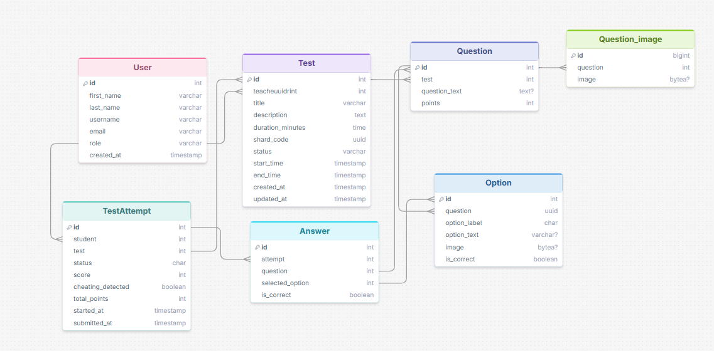
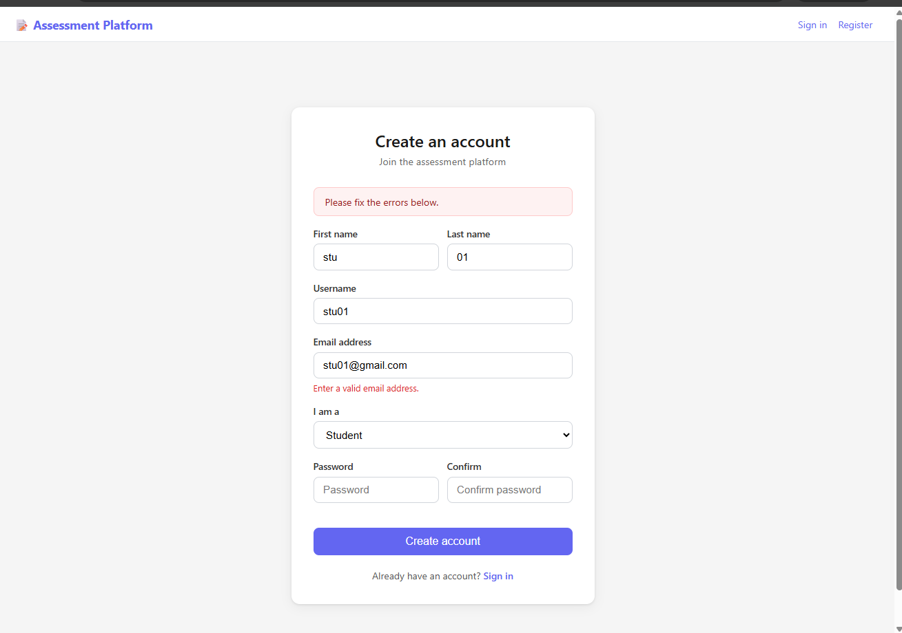
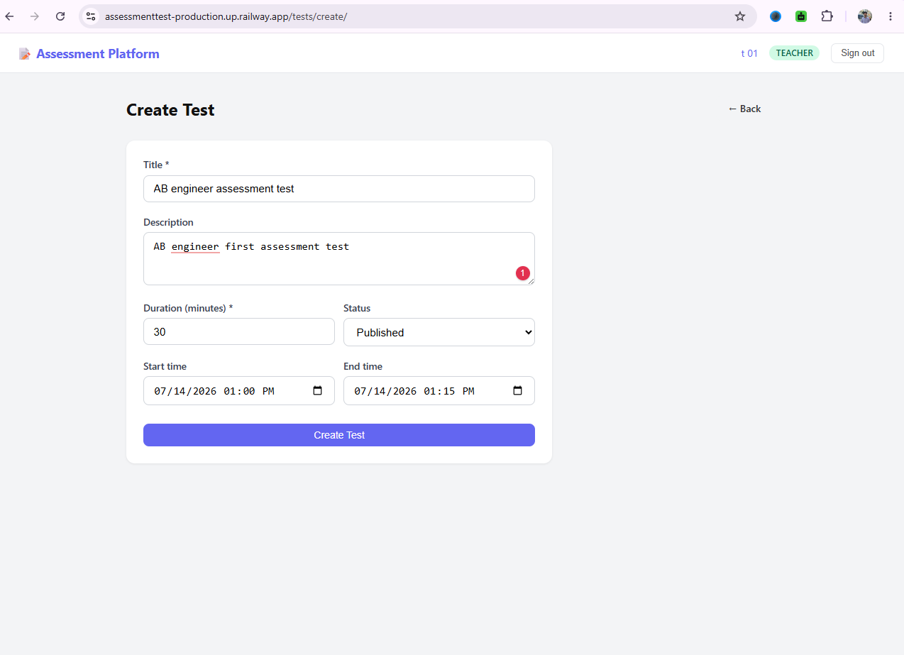
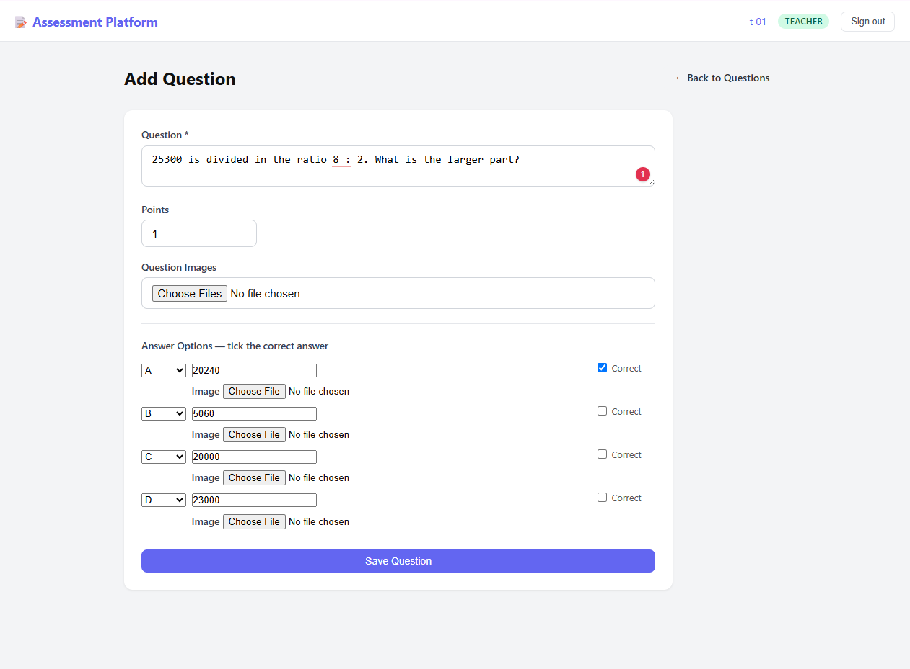
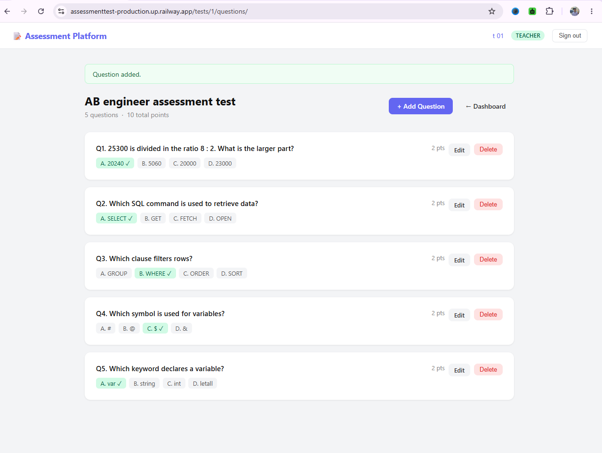
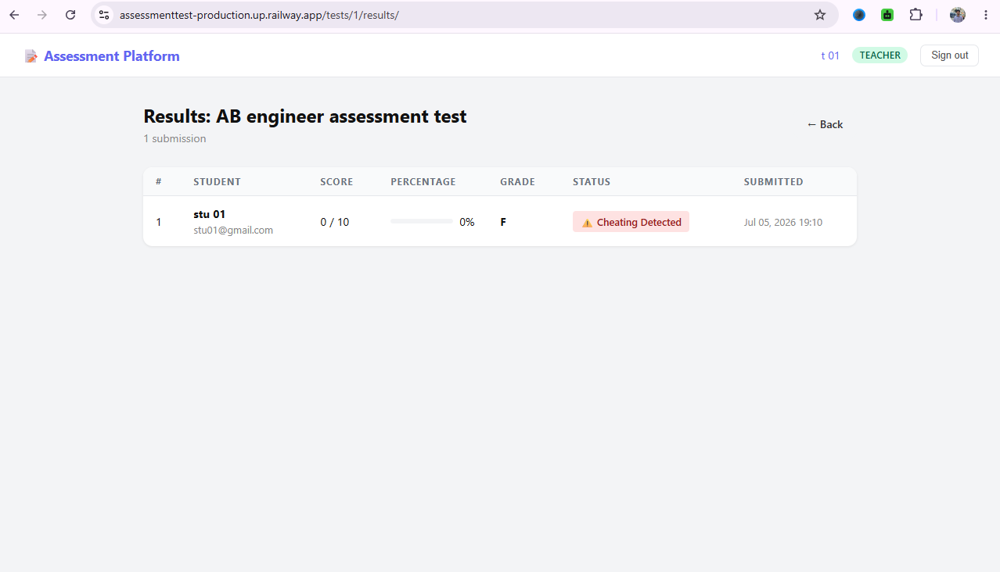
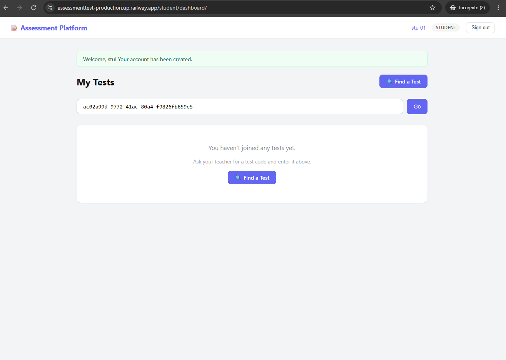
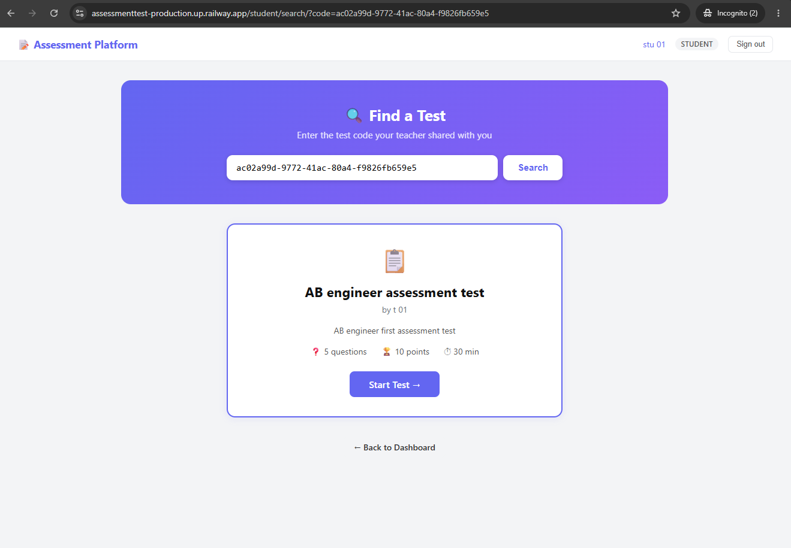
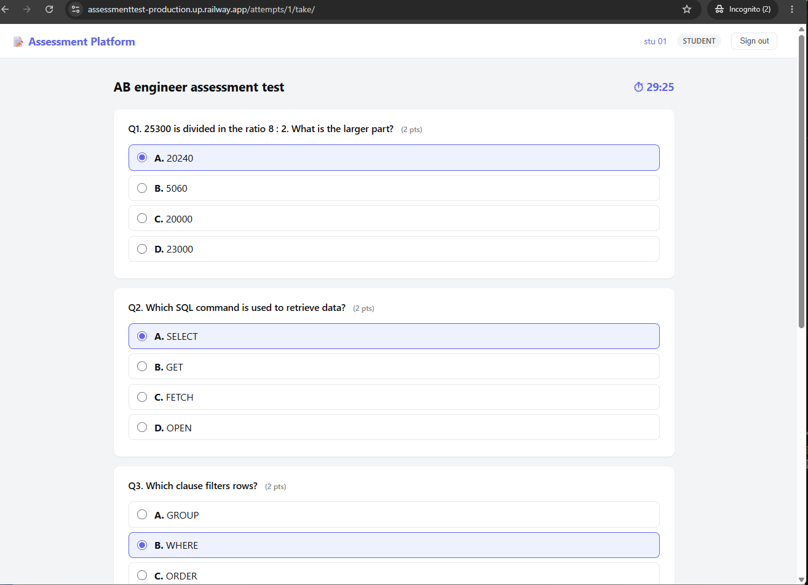
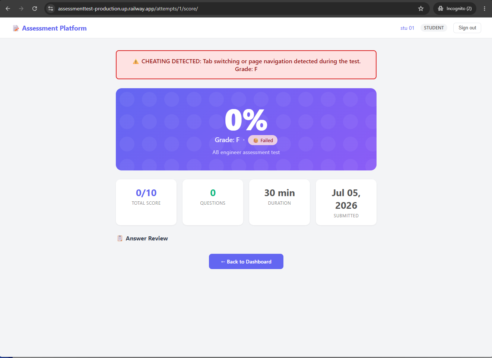

# ASSESSMENT Platform
A MCQ assessment taking platform.
- Teacher can create MCQ Test
- MCQ question types text and image
- Teacher can see all students submitted test results
- Student can participate the test using shared code
- After complete the test student can see there results

Detect cheating:
- if students create new tab
- if students go to another tab

Tools: Django, CICD, Docker

live: https://assessmenttest-production.up.railway.app/

## ER diagram



# web images
## Teachers views
### create account


### create test


### add question


### question list


### submission list


## Student views
### student dashboard


### student find test


### test start


### see result



## Setup & Run

### Prerequisites

- Python 3.11+

---

### 1. Clone the Repository

```bash
git clone https://github.com/Shuvo018/assessment_test.git
cd assessment_test
```

### 2. Create and Activate a Virtual Environment

```bash
python -m venv venv

# Linux / macOS
source venv/bin/activate

# Windows
venv\Scripts\activate
```

### 3. Install Dependencies

```bash
pip install -r requirements.txt
```

### 4. Apply Migrations

```bash
python manage.py migrate
```

### 5. Create a Superuser

```bash
python manage.py createsuperuser
```


### 6. Run the Development Server

```bash
python manage.py runserver
```

App: [http://127.0.0.1:8000](http://127.0.0.1:8000)  
Admin: [http://127.0.0.1:8000/admin](http://127.0.0.1:8000/admin)

---